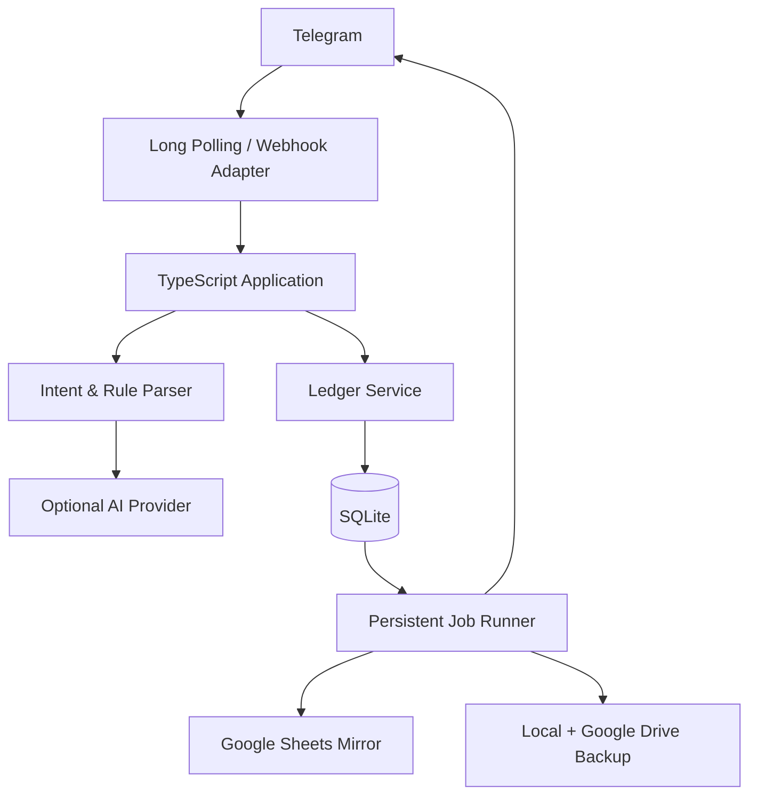

# Ledger Bot 個人財務系統規格書

版本：0.2  
狀態：需求討論完成，待實作  
日期：2026-09-17  
Bot 顯示名稱：Ledger Bot  
Repository：`personal-ledger`  
主要使用者：單一 Telegram 帳號擁有者

## 1. 文件目的

本文件定義一套透過 Telegram 操作的個人財務追蹤工具。使用者以自然語言輸入交易，系統使用規則及 AI 產生結構化草稿，經使用者確認後寫入正式帳本，並提供查詢、統計、代墊追蹤、Google Sheets 鏡像及資料匯出。

本版規格取代 v0.1。主要變更如下：

- 正式帳本由 Google Sheets 改為 SQLite，Sheet 改為非同步查詢鏡像。
- 帳務模型拆分為資金效果、交易用途及金額配置（allocation）。
- 支援一則訊息建立多筆交易草稿。
- 明確定義代墊、回收、放棄回收、信用卡、退款及複合手續費。
- 所有交易、修改及刪除都可追溯至 Telegram 原始事件。
- AI 可直接填入草稿，但不得跳過使用者確認正式入帳。
- 增加持久化背景工作、重啟恢復、備份、還原及永久刪除規則。

## 2. 產品定位與核心決策

| 項目 | 決策 |
|---|---|
| Bot 顯示名稱 | Ledger Bot |
| Repository | `personal-ledger` |
| 產品定位 | Telegram 對話式個人財務帳本 |
| 核心優先級 | 降低日常記帳阻力，同時維持可可靠統計的資料品質 |
| 使用者 | MVP 僅單一白名單使用者；資料模型保留未來多人化能力 |
| 帳本精度 | 帳戶感知的現金流與消費帳本，不保證可與所有帳戶餘額完整對帳 |
| 正式資料來源 | SQLite |
| 查詢介面 | Telegram 指令、自然語言查詢及 Google Sheets 鏡像 |
| 預設幣別 | TWD |
| 預設時區 | Asia/Taipei |
| 後端語言 | TypeScript |
| 執行方式 | Docker；本機優先，保留遷移至雲端的能力 |
| 入帳原則 | 每筆交易都必須經使用者確認 |

### 2.1 核心設計原則

1. AI 或規則只能建立及修改草稿，不能直接建立正式交易。
2. 交易確認畫面必須揭露所有會影響統計的金額配置。
3. 正式交易同時描述實際資金移動與個人財務意義。
4. 每筆交易及每次變更都能追溯至來源事件。
5. 所有統計由程式以精確十進位計算，AI 不負責加總。
6. Google Sheets 是查詢鏡像，不是正式帳本，也不阻擋正式入帳。
7. 已確認資料使用軟刪除；永久刪除必須經二次確認。
8. 外部服務故障、程式重啟及 Telegram 重送不得造成重複入帳或遺失已確認工作。

## 3. 目標與非目標

### 3.1 產品目標

- 一般交易可在 10 秒內完成輸入與確認。
- 常見口語輸入可轉成可編輯的結構化草稿。
- 同時回答「實際流入流出多少」與「個人真正收入、消費多少」。
- 可追蹤未回收代墊及其後續回收或轉為請客的狀態。
- 資料可直接在 Sheet 閱讀、篩選及製作臨時分析。
- 系統可在本機長期運行並於重啟後恢復未完成工作。

### 3.2 非目標

- 銀行或信用卡自動串接。
- 精確帳戶餘額對帳。
- 完整複式簿記。
- 發票或收據 OCR。
- 投資部位、未實現損益及資產估值。
- 自動執行金融交易或投資決策。
- 第一階段的 Web 管理後台。
- 第一階段的週期交易自動建立。

## 4. 分階段範圍

### 4.1 第一階段：日常可用版本

- Telegram 私聊及白名單驗證。
- 收入、支出、帳戶轉帳及退款。
- allocation 資料模型。
- 代墊、部分回收、完整回收及放棄回收。
- 一則訊息最多建立 10 筆獨立草稿。
- 規則式解析、缺少欄位追問及完整確認流程。
- 修改、取消、軟刪除及稽核紀錄。
- 最近交易、今日、本月、分類、標籤及未回收代墊查詢。
- SQLite 正式帳本。
- Google Sheets 非同步唯讀鏡像。
- 待處理清單、背景重試、重啟恢復及 `/status`。
- 完整匯出及每日備份。

### 4.2 第二階段

- AI 解析正式啟用。
- 自然語言查詢。
- 借款、借出及還款的完整追蹤。
- 外幣與海外手續費流程。
- 信用卡分期付款預估。
- 每月摘要及異常通知。
- 從 Sheet 管理分類、規則及帳戶別名。
- 歷史資料匯入。

### 4.3 後續評估

- 多使用者隔離及權限。
- 銀行、信用卡或發票自動匯入。
- 預算、預測及更完整的資產帳本。
- Web 管理介面。
- 週期交易範本或到期草稿。

## 5. 核心帳務概念

### 5.1 交易與 allocation

一筆 `Transaction` 代表一次可觀察的財務事件，例如刷卡、現金付款、收到匯款或帳戶轉帳。每筆交易包含一筆以上 `Allocation`，用來描述金額的財務用途。

交易總額與 allocation 必須符合：

```text
transaction.amount = sum(allocation.amount)
```

複合轉帳可同時包含內部移轉及費用。例如銀行扣款 1,015、另一帳戶收到 1,000：

```text
交易總流出：1,015
- 內部轉帳：1,000
- 金融手續費支出：15
```

### 5.2 資金效果 `funds_effect`

資金效果記錄在 allocation 層級，因為同一交易可能同時包含內部轉帳與手續費支出。

| 值 | 說明 |
|---|---|
| `inflow` | 可動用現金或銀行資金增加 |
| `outflow` | 可動用現金或銀行資金減少 |
| `internal` | 使用者自身可動用資金帳戶之間移轉，淨效果為零 |
| `none` | 不影響當下可動用資金，例如信用卡刷卡或刷退 |

### 5.3 財務用途 `purpose`

| 值 | 統計意義 |
|---|---|
| `income` | 個人收入 |
| `expense` | 個人消費或支出 |
| `transfer` | 自有帳戶移轉，不列入收入或消費 |
| `refund` | 沖減原消費分類 |
| `advance` | 替他人代墊，可列入實際流出但不列入個人消費 |
| `advance_recovery` | 代墊回收，可列入實際流入但不列入個人收入 |
| `loan_out` | 借出資金 |
| `loan_in` | 借入資金 |
| `loan_repayment` | 借款或借出款還款 |
| `fee` | 手續費等個人支出 |

`purpose` 是受控值，不以自由標籤替代。自由標籤用於聚餐、旅行、家庭等個人情境。

### 5.4 統計雙口徑

摘要同時提供：

1. 資金口徑：依 allocation 的 `funds_effect` 計算實際流入、實際流出及淨資金流。
2. 個人財務口徑：個人收入、個人消費及收支結餘。

代墊在未回收前仍顯示為實際流出，但不會把他人負擔部分算入個人消費。

## 6. 帳務規則

### 6.1 一般收入與支出

- 金額必須大於 0，資料庫不得以正負號表達方向。
- 正負號僅可作為輸入解析提示。
- 每個 allocation 可有自己的分類、次分類及系統用途。
- 交易層可有自由標籤；allocation 層保存具有統計意義的系統標籤。

### 6.2 代墊與分帳

輸入：`聚餐 1260，我先付，朋友欠我一半`

預期結果：

```text
交易總額：1,260
- 個人餐飲支出：630，funds_effect=outflow，purpose=expense
- 朋友代墊：630，funds_effect=outflow，purpose=advance，counterparty=朋友
```

規則：

- 若個人負擔或代墊金額不明，必須追問，不得猜測。
- 回收代墊時，依對象與未回收項目提供候選，由使用者確認關聯。
- 支援部分回收、一次回收多筆及單筆流入的多個 allocations。
- 超額回收時，超出部分必須另外分類。
- 未回收代墊可依對象、日期及餘額查詢。
- 使用者決定不再回收時，將原 `advance` allocation 改為 `expense`。
- 放棄回收的消費歸屬原交易日期；決策日期及前後狀態保存在 AuditLog。

### 6.3 借款與還款

- 借款與代墊分開統計。
- 借款相關 allocation 不列入個人收入或消費。
- 使用 `counterparty` 保存對方，不把人物建模為自有金融帳戶。
- 完整借還款餘額追蹤排入第二階段。

### 6.4 帳戶轉帳與手續費

- 自有帳戶間轉帳使用 `account_from` 與 `account_to`。
- 兩個可動用資金帳戶間的轉帳本金使用 `funds_effect=internal`，不列入資金淨流出、個人收入或消費。
- 轉帳手續費可在同一交易中以 `funds_effect=outflow`、`purpose=fee` 的 allocation 表示。
- 提款可表示為銀行至現金的內部轉帳；提款手續費另列支出 allocation。

### 6.5 信用卡

- 刷卡日以 `funds_effect=none`、`purpose=expense` 認列個人消費，不列為當日可動用資金流出。
- 繳卡費是一筆獨立的銀行至信用卡轉帳，使用 `funds_effect=outflow`、`purpose=transfer`。
- 繳卡費不再次列入個人消費，也不需要關聯個別刷卡交易。
- MVP 不提供信用卡未繳餘額估算。
- 分期消費在購買日一次認列完整個人消費。
- 分期計畫僅顯示未來預估付款，不自動建立正式交易。

### 6.6 退款

- 退款建立獨立交易，不修改或刪除原交易。
- 系統依商家、金額、分類及日期推薦原交易，由使用者確認。
- 可在找不到原交易時入帳，但必須確認退款分類。
- 關聯成功時沿用原 allocation 分類。
- 退款計入實際發生月份，不回寫原消費月份。
- 退款回到現金或銀行時使用 `funds_effect=inflow`；刷退至信用卡時使用 `funds_effect=none`。
- 報表同時顯示當期支出、退款及淨支出，允許淨支出為負數。

### 6.7 外幣

第二階段保存原幣金額與幣別、實際 TWD 基準金額，以及海外手續費及其獨立分類。

系統不依賴自動匯率作為正式入帳金額。未提供實際 TWD 金額時，交易留在待處理狀態。

### 6.8 金額精度

- SQLite 內以精確十進位的字串或等價 decimal abstraction 保存金額。
- 禁止使用 IEEE 浮點數執行帳務計算。
- 每次寫入都驗證 allocation 合計與交易總額相等。

## 7. Telegram 使用流程

### 7.1 新增單筆交易

1. 使用者傳送自然語言。
2. 系統驗證 `user_id` 與私人聊天。
3. 系統建立不可變的 InputEvent。
4. 意圖解析器判斷新增、查詢、修改或其他操作。
5. 規則解析器及必要時的 AI 產生交易草稿。
6. 缺少必要欄位時立即追問，並保存待處理項目。
7. 系統顯示完整預覽。
8. 使用者確認、修改或取消。
9. 確認後以資料庫交易執行冪等寫入及 AuditLog。
10. Bot 回覆 `transaction_id`；Sheet 同步改由背景工作處理。

### 7.2 多筆交易

- 一則訊息最多建立 10 筆草稿。
- 每筆草稿各有 `draft_id`、`request_id` 及獨立狀態。
- 同批草稿共用 `batch_id` 及來源事件。
- 每筆各發一則預覽訊息，可獨立確認、修改或取消。
- 部分項目解析失敗時，成功項目照常顯示；失敗項目另外追問。
- 超過 10 筆時要求使用者拆分輸入。

### 7.3 預覽內容

確認畫面至少顯示日期、各 allocation 的資金效果與交易用途、總額、幣別、帳戶、商家、交易對象、關聯交易及解析警告。所有會影響統計的 allocation 不得隱藏於次級畫面。

### 7.4 修改與對話路由

- 按鈕 callback 必須帶有明確 `draft_id`。
- 多個草稿存在時，文字修改應 reply 指定預覽訊息。
- 未指定草稿的補充內容會顯示最近草稿供使用者選擇。
- 支援欄位式修改及自然語言一次修改多個欄位。
- 修改後重新顯示完整預覽。
- 已確認交易可直接更新；AuditLog 保存前後快照。

### 7.5 舊草稿與待處理項目

- 草稿及待處理項目不自動刪除。
- 舊 Telegram 按鈕不得直接確認長期未處理草稿。
- 重新開啟草稿時，必須再次顯示日期、金額及解析結果。
- `/pending` 分為等待補充、等待確認及同步失敗。
- 使用者可封存項目；封存不刪除來源事件。

### 7.6 刪除

- `刪除上一筆` 指最近確認成功的交易，不以發生日期判斷。
- 刪除前必須顯示預覽並再次確認。
- 若最近一次操作為批次，先顯示該批交易供選擇。
- 已確認交易預設軟刪除。
- 存在退款、回收等關聯時，顯示影響清單，讓使用者選擇解除關聯或一併軟刪除。

## 8. 指令與查詢

### 8.1 Telegram 指令

| 指令 | 功能 |
|---|---|
| `/start` | 初始化使用者、確認時區與預設幣別 |
| `/help` | 顯示指令及輸入範例 |
| `/recent [N]` | 最近 N 筆有效交易，預設 10 筆 |
| `/today` | 今日雙口徑摘要 |
| `/month` | 本月雙口徑摘要及分類排名 |
| `/pending` | 待補充、待確認及同步失敗項目 |
| `/advances` | 未回收代墊清單及餘額 |
| `/settings` | 使用者設定及通知偏好 |
| `/status` | 系統、同步、背景工作及備份狀態 |

### 8.2 自然語言查詢

第二階段支援例如 `上個月餐飲花多少？`、`列出日本旅行的支出`、`這個月實際流出跟個人消費差多少？`。

查詢規則：

- AI 只能產生受限 QuerySpec，例如期間、指標、分類、帳戶、標籤、排序及分頁。
- AI 不得直接產生或執行 SQL。
- 統計及排序由程式執行。
- 新增與查詢意圖不明時，顯示「新增交易」及「查詢」按鈕。
- 明細預設每頁 10 筆，提供上一頁、下一頁、查看 Sheet 及匯出 CSV。

## 9. 統計定義

### 9.1 核心指標

| 指標 | 定義 |
|---|---|
| 實際流入 | 期間內 allocation `funds_effect=inflow` 的有效金額 |
| 實際流出 | 期間內 allocation `funds_effect=outflow` 的有效金額 |
| 淨資金流 | 實際流入減實際流出 |
| 個人收入 | `purpose=income` 的 allocation 合計 |
| 個人消費 | `purpose=expense` 或 `fee` 的 allocation，扣除退款 |
| 收支結餘 | 個人收入減個人消費 |
| 未回收代墊 | `advance` 減已關聯的 `advance_recovery` 及已轉為個人支出的金額 |
| 分類淨支出 | 分類支出減該分類退款 |

### 9.2 報表規則

- 僅納入 `status=confirmed` 的交易及 allocations。
- 軟刪除交易排除於所有一般統計。
- 月中比較使用上月同期，不推估整月。
- 完整月份查詢比較完整月份。
- 日均支出除以查詢期間已經過的日曆天數。
- 退款大於當期支出時，同時顯示支出、退款及負的淨額。
- 分類占比以個人淨消費為分母；分母小於或等於零時不顯示占比。
- 時區或預設幣別變更只影響未來解析及顯示，不重算歷史交易。

### 9.3 月摘要

第二階段預設於每月 1 日 09:00 傳送上個完整月份摘要，可在 `/settings` 修改或關閉。摘要包含雙口徑指標、分類排名、上月比較、未回收代墊／借款及同步異常。

未回收代墊不另行反覆提醒，只列於月摘要及主動查詢結果。

## 10. 分類、標籤與規則

### 10.1 分類結構

- 分類固定為主分類及次分類兩層。
- 更多細節使用標籤，不建立任意深度分類樹。
- 主分類、次分類及關鍵字皆可由使用者管理。
- AI 只能從啟用中的分類選擇，不得自行創造分類名稱。

### 10.2 初始分類

收入：薪資、獎金、投資收入、其他收入。  
支出：餐飲、交通、購物、居住、娛樂、醫療、學習、人情、旅遊、金融費用、其他支出、待分類。

退款、代墊及借款由 `purpose` 表示，不建立與用途重複的主分類。

### 10.3 標籤

- 系統標籤屬 allocation，例如代墊、借出、借入、還款及可報帳。
- 自由標籤屬交易，例如朋友聚餐、日本旅行、家庭及工作。
- 系統標籤採受控名稱，自由標籤允許使用者新增。

### 10.4 規則優先級

解析順序：使用者明確輸入、使用者自訂分類規則、商家／帳戶別名與關鍵字、AI 建議、待分類或追問。

規則可依商家、資金效果、帳戶及文字關鍵字設定，並具有明確優先級。優先級相同且結果衝突時必須詢問。

### 10.5 從修正建立規則

- 使用者修正商家或分類後，系統詢問是否建立新規則。
- 不得因單次修正自動建立永久規則。
- 新規則預設只影響未來交易。
- 歷史重分類必須先顯示受影響交易及統計差異，再由使用者確認批次修改。

## 11. 解析與 AI

### 11.1 解析策略

1. 先判斷訊息意圖。
2. 使用確定性規則解析日期、金額、分隔符、帳戶別名及明確商家。
3. 規則無法完整解析時呼叫 AI。
4. AI 輸出通過 schema、列舉值、金額及 allocation 驗證。
5. 產生可編輯草稿及欄位信心度。

### 11.2 AI 權限邊界

- AI 可直接填入交易草稿。
- AI 不得跳過確認建立正式交易。
- AI 不負責金額加總、比例、排名或 SQL 執行。
- AI 可接收當前訊息、有效分類及帳戶別名。
- AI 不接收整份帳本或不必要的交易歷史。
- 供應商必須具備良好中文理解能力及合適的資料保留／訓練政策。

### 11.3 信心度與故障

- 每個解析欄位各自保存信心度，另計算整體結果。
- 金額、必要資金效果及 allocation 不明時必須追問。
- 分類低信心時可使用待分類並允許確認。
- 帳戶為選填；未指定時使用「未指定帳戶」。
- 沒有 API Key 或 AI 不可用時，規則解析及逐欄詢問仍可完成記帳。
- 當下無法完成時，項目進入待處理清單，可重新詢問或重送 AI。
- AI 呼叫保存 provider、model、prompt version、結構化輸出、耗時及狀態，不另外複製完整原文。

### 11.4 上線方式

- 先以 20 至 30 條匿名化真實輸入建立評測集。
- AI 初期使用 shadow mode，不影響使用者看到的草稿。
- 綜合必要欄位、其他欄位、中文語意、延遲、成本及資料政策後人工決定啟用。
- 啟用後 AI 可填入草稿，但仍必須經使用者確認。
- AI provider 介面必須可替換。

## 12. 回應時間

- 正常規則解析及一般查詢目標在 3 秒內完成。
- 背景處理緩衝時間可設定，預設 2 秒。
- 緩衝時間內完成時直接回傳預覽。
- 超過緩衝時間時先回覆處理中，完成後再傳送預覽。
- Webhook 或 polling 接收流程不得同步等待長時間外部呼叫。

## 13. 資料模型

### 13.1 主要資料表

| 資料表 | 用途 |
|---|---|
| `owners` | 使用者及預設設定 |
| `input_events` | Telegram 訊息、編輯、callback 及系統事件的不可變快照 |
| `batches` | 同一輸入產生的交易群組 |
| `drafts` | 待補充、待確認、取消或封存的草稿 |
| `transactions` | 正式財務事件 |
| `allocations` | 交易金額的用途及分類配置 |
| `transaction_links` | 退款、回收、借還款等交易關聯 |
| `accounts` | 現金、銀行、信用卡及電子支付帳戶 |
| `merchants` | 標準商家及別名 |
| `counterparties` | 代墊或借貸對象及別名 |
| `categories` | 兩層分類及啟用狀態 |
| `tags` | 系統標籤及自由標籤 |
| `classification_rules` | 使用者分類規則及優先級 |
| `audit_events` | 新增、修改、刪除、關聯及批次變更紀錄 |
| `jobs` | AI、Sheet 同步、備份、通知及重試工作 |
| `settings` | 使用者及執行期設定 |

### 13.2 `input_events`

至少包含 `event_id`、`owner_id`、`event_type`、Telegram update/chat/message/callback ID、`reply_to_message_id`、`raw_input`、`received_at` 及 `supersedes_event_id`。

Telegram 訊息編輯不得覆蓋原事件；新版本使用 `supersedes_event_id` 關聯。

### 13.3 `transactions`

至少包含：

- `transaction_id`、`owner_id`、`batch_id`、`request_id`、`source_event_id`
- `source_type`、`source_ref`
- `occurred_date` 及可空的 `occurred_time`
- `amount`、`currency`、`base_amount`、`base_currency`
- `account_from_id`、`account_to_id`、`merchant_id`、`counterparty_id`
- `note`、`raw_input_snapshot`
- `status`、`created_at`、`updated_at`、`deleted_at`

`status` 至少包含 `confirmed` 及 `deleted`。正式帳本不保存 `pending` 交易；待確認內容存在 `drafts`。

### 13.4 `allocations`

至少包含 `allocation_id`、`transaction_id`、`funds_effect`、`purpose`、`amount`、分類與次分類 ID、`counterparty_id`、系統標籤及備註。

### 13.5 `drafts`

狀態至少包含：

```text
parsing
awaiting_input
awaiting_confirmation
processing
confirmed
cancelled
needs_attention
archived
```

草稿不自動刪除。封存只影響預設待處理清單。

### 13.6 `audit_events`

至少包含 `audit_event_id`、`owner_id`、`transaction_id`、`source_event_id`、`action`、`before_json`、`after_json` 及 `created_at`。

Bot 內的新增、修改、刪除、關聯、解除關聯及歷史批次修改都必須記錄。第一階段 Sheet 交易資料唯讀，因此不存在由 Sheet 直接修改正式交易的稽核缺口。

### 13.7 識別與冪等

- `telegram_update_id` 用於外部事件去重。
- 每個草稿產生唯一 `request_id`。
- 每筆正式交易產生唯一 `transaction_id`。
- 同一 `request_id` 重送時回傳既有交易，不新增資料。
- callback query 必須記錄處理結果，避免連續點擊重複入帳。
- 所有資料表預留 `owner_id`，但 MVP 不實作多人權限流程。

## 14. Google Sheets 鏡像

### 14.1 定位

- SQLite 是唯一真相來源。
- Sheet 用於直接閱讀、排序、篩選、公式及臨時分析。
- Sheet 寫入失敗不得使正式入帳失敗。
- 第一階段交易鏡像唯讀。

### 14.2 工作表

| 工作表 | 說明 |
|---|---|
| `Transactions` | 交易主資料及完整 `raw_input_snapshot` |
| `Allocations` | 金額配置、用途及分類 |
| `Accounts` | 帳戶鏡像 |
| `Categories` | 分類鏡像 |
| `AuditLog` | 稽核事件，預設隱藏 |
| `MonthlySummary` | 方便閱讀的月摘要，非統計真相來源 |

### 14.3 同步策略

- 資料庫提交後建立持久化 outbox job。
- 背景工作依穩定 ID 執行 upsert。
- 正常情況下在 1 分鐘內更新 Sheet。
- 修改及軟刪除也必須同步。
- 每日執行完整校正，修復漏同步或欄位不一致。
- 同步多次失敗後進入 `needs_attention` 並發送異常通知。
- `/status` 顯示待同步數量及最後成功時間。

第二階段可允許從 Sheet 管理分類、關鍵字及帳戶別名。交易資料維持唯讀，不建立交易雙向同步。

## 15. 系統架構



### 15.1 部署拓撲

- 單一 TypeScript 應用容器。
- SQLite 位於 Docker persistent volume。
- 程式內維持 Telegram、解析、帳務、查詢、工作及外部 adapter 的模組邊界。
- 本機使用 long polling，不需要公開連入連接埠。
- 雲端環境可改用 HTTPS webhook。
- 兩種 Telegram 接收模式由環境變數切換並共用核心處理流程。

### 15.2 本機可用性與 SQLite

- 預期主機幾乎全天開機，Docker 設定自動重啟政策。
- 若離線超過 Telegram 更新保留期限，使用者接受重新傳送訊息。
- SQLite 使用 WAL 模式，資料庫、WAL 及 SHM 位於同一 persistent volume。
- 使用 migration 管理 schema。
- 啟動時先備份，再自動執行尚未套用的 migration。
- migration 失敗時停止啟動，不以部分升級狀態繼續服務。

## 16. 背景工作與恢復

### 16.1 持久化工作

AI 解析、Sheet 同步與校正、備份、通知及外部服務重試都必須先寫入 `jobs`。

### 16.2 重啟恢復與重試

- 啟動時掃描尚未完成或 lease 已逾期的工作。
- 工作 handler 必須冪等。
- 已確認但尚未完成後續同步的交易不得遺失。
- AI 中斷時可重試；無法完成則回到待處理清單。
- 暫時性錯誤使用指數退避。
- 超過最大重試次數後改為 `needs_attention` 並通知使用者。
- 不得永久無限重試或在第一次暫時性失敗就通知。

## 17. 安全與隱私

- 僅處理白名單 Telegram `user_id` 的私人聊天。
- 不在群組回傳或處理個人財務資料。
- Bot Token、Google 憑證及 AI API Key 使用環境變數或 Docker secret 類型機制。
- 正式環境日誌只記 ID、階段、耗時、結果及錯誤碼。
- 開發環境只有在明確啟用 debug flag 時可將完整訊息輸出至本機 console，不寫入永久 log 檔。
- 資料庫保存必要的完整原始訊息，並可永久刪除。
- 本機資料依賴作業系統磁碟加密；Drive 備份依賴 Google 帳號安全，第一階段不增加應用程式層加密。
- AI 供應商不得取得整份帳本，且必須評估其資料保留與訓練政策。

## 18. 備份、匯出與永久刪除

### 18.1 備份

- 每日建立 SQLite 一致性快照。
- 快照保存於本機及 Google Drive。
- 保存期限可設定，預設 30 天。
- migration 前額外建立快照。
- 每次發布新版本都執行一次備份還原驗證。

### 18.2 匯出

維護 CLI 提供各資料表 CSV、保留完整關聯的 JSON，以及可完整還原的 SQLite 快照。

資料 schema 預留 `source_type`、`source_ref` 及匯入批次識別，但第一階段不實作歷史匯入。

### 18.3 永久刪除

- 日常刪除只做軟刪除。
- 永久刪除需要明確指令及二次確認。
- 使用者可只刪除目前資料庫，讓舊備份依期限淘汰。
- 使用者也可刪除所有保留中的舊備份，再立即產生乾淨備份。
- 永久刪除結果必須記錄不含敏感內容的系統事件。

## 19. 設定與維護工具

### 19.1 使用者設定

透過 `/settings` 管理時區、預設與基準幣別、月摘要、AI 開關及顯示偏好。時區及預設幣別變更不回溯修改歷史交易。

### 19.2 部署設定

透過環境變數管理 Telegram Token、白名單、接收模式、資料與備份路徑、Google API、Sheet ID、AI provider／model／API Key、重試、回應緩衝及備份期限。

### 19.3 維護 CLI

高風險維護功能只透過 Docker 內 CLI 提供：備份與驗證、還原、migration、Sheet 校正、CSV／JSON／SQLite 匯出及永久刪除。Telegram `/status` 只提供唯讀狀態。

## 20. 錯誤處理

| 情境 | 使用者行為 | 系統處理 |
|---|---|---|
| 未授權帳號 | 顯示未授權 | 不洩漏白名單或資料內容 |
| 缺少金額 | 詢問金額 | 保留草稿，不允許確認 |
| 缺少資金效果或 allocation | 詢問必要資訊 | 保留來源事件及待處理狀態 |
| 多個可能金額 | 顯示候選值 | 使用者選擇後重新預覽 |
| 多筆中部分失敗 | 成功項目照常預覽 | 失敗項目個別追問 |
| 新增或查詢意圖不明 | 顯示意圖選擇按鈕 | 不自行猜測 |
| AI 逾時 | 先顯示處理中 | 重試或進入待處理清單 |
| AI 不可用 | 逐欄詢問 | 不阻擋規則式記帳 |
| SQLite 寫入失敗 | 不宣告成功 | 保留可安全重試的工作 |
| 重複 callback | 回傳既有交易 | 不新增第二筆 |
| Sheet 失敗 | 正式入帳仍成功 | 背景重試，超限後通知 |
| 關聯交易刪除 | 顯示影響清單 | 由使用者選擇解除或一起刪除 |
| 舊草稿確認 | 要求重新預覽 | 不接受舊按鈕直接入帳 |

## 21. 驗收條件

### 21.1 核心交易

| 編號 | 情境 | 預期結果 |
|---|---|---|
| AC-01 | `午餐 120` | 產生今日、支出 120、餐飲草稿，確認後入帳 |
| AC-02 | `薪水 +85000` | 產生收入 85,000 草稿 |
| AC-03 | `昨天 Uber 245 國泰卡` | 日期為昨日，商家及帳戶正確 |
| AC-04 | `台新轉國泰 5000` | 建立內部轉帳，不增加個人收入或消費 |
| AC-05 | 同一 callback 重送兩次 | 資料庫只有一筆正式交易 |
| AC-06 | 取消草稿 | 正式帳本不新增交易，來源事件保留 |
| AC-07 | 修改已確認交易 | 交易更新，AuditLog 保存前後快照及來源事件 |
| AC-08 | 軟刪除交易 | 一般統計排除交易，AuditLog 仍可追溯 |

### 21.2 多筆與代墊

| 編號 | 情境 | 預期結果 |
|---|---|---|
| AC-09 | `午餐 120，咖啡 60` | 產生兩筆獨立草稿及共同 batch |
| AC-10 | 三筆中一筆缺少金額 | 兩筆正常預覽，一筆進入追問 |
| AC-11 | `聚餐 1260，我先付，朋友欠一半` | 交易總額 1,260，個人支出及代墊各 630 |
| AC-12 | 回收代墊 300 | 建立流入及回收 allocation，未回收餘額剩 330 |
| AC-13 | 放棄回收剩餘 330 | 原 allocation 改為個人支出，原月份統計更新且有 AuditLog |
| AC-14 | 代墊 630、收到 700 | 630 關聯回收，剩餘 70 要求另外分類 |

### 21.3 信用卡、退款與費用

| 編號 | 情境 | 預期結果 |
|---|---|---|
| AC-15 | 信用卡消費 1,200 | 刷卡日列入個人消費，但不列入當日可動用資金流出 |
| AC-16 | 信用卡繳款 18,000 | 獨立帳戶轉帳並列入銀行資金流出，不重複計入消費 |
| AC-17 | 信用卡分期 30,000／12 期 | 消費一次認列，付款計畫只作預估 |
| AC-18 | 退款 990 並關聯購物交易 | 退款月沖減原分類，原交易不被修改 |
| AC-19 | 轉帳 1,000、手續費 15 | 單一交易含轉帳及費用 allocation |

### 21.4 可靠性與鏡像

| 編號 | 情境 | 預期結果 |
|---|---|---|
| AC-20 | 確認後程式立即重啟 | 正式交易存在，未完成工作於啟動後恢復 |
| AC-21 | Sheet 暫時失敗 | 正式入帳成功，Sheet 工作安全重試 |
| AC-22 | Sheet 恢復 | 通常 1 分鐘內完成鏡像且無重複列 |
| AC-23 | 工作超過重試上限 | 進入 `needs_attention` 並發送異常通知 |
| AC-24 | migration 失敗 | 使用升級前快照，服務不以半升級狀態啟動 |
| AC-25 | 備份還原測試 | 可還原交易、關聯、AuditLog、草稿及工作狀態 |

### 21.5 來源追蹤與隱私

| 編號 | 情境 | 預期結果 |
|---|---|---|
| AC-26 | 從交易查看來源 | 可定位原始 InputEvent、Telegram message 及同批交易 |
| AC-27 | Telegram 訊息被編輯 | 原事件不覆蓋，新版本建立關聯事件 |
| AC-28 | 正式環境發生錯誤 | Docker log 不含完整財務原文或憑證 |
| AC-29 | 永久刪除敏感原文 | 主資料清除；可選擇清除舊備份並建立乾淨備份 |
| AC-30 | 未授權或群組訊息 | 不處理交易且不回傳財務資訊 |

## 22. 完成定義

第一階段完成需符合：

- 第一階段所有功能完成並通過相應驗收條件。
- 固定測試資料的所有金額、allocation 及統計完全正確。
- Telegram 重送、callback 重複及程式重啟不產生重複交易。
- 所有交易、修改及刪除可追溯來源事件。
- 正式環境日誌及程式碼不含 Token、憑證或完整財務原文。
- 已提供 Docker 啟動、環境變數、資料路徑及維護 CLI 文件。
- 已完成 Sheet 鏡像初始化及校正測試。
- 已完成備份、Drive 上傳及還原驗證。
- 已使用實際記帳流程連續試用並修正阻斷性問題。

## 23. 明確延後的決策

以下項目刻意延後，不應在實作中自行假設：

| 決策 | 決定方式 |
|---|---|
| AI provider 與 model | 使用匿名化真實測試集比較後決定 |
| 雲端部署平台 | 本機 Docker 實際使用後，依可用性需求評估 |
| Sheet 設定同步 | 第一階段穩定後再設計衝突與版本策略 |
| 歷史資料匯入格式 | 取得實際來源資料後定義 mapping |
| 完整借貸、外幣及分期功能順序 | 依第一階段實際使用頻率排序 |
| 多使用者 | 僅保留 owner 邊界，不在 MVP 實作 |
